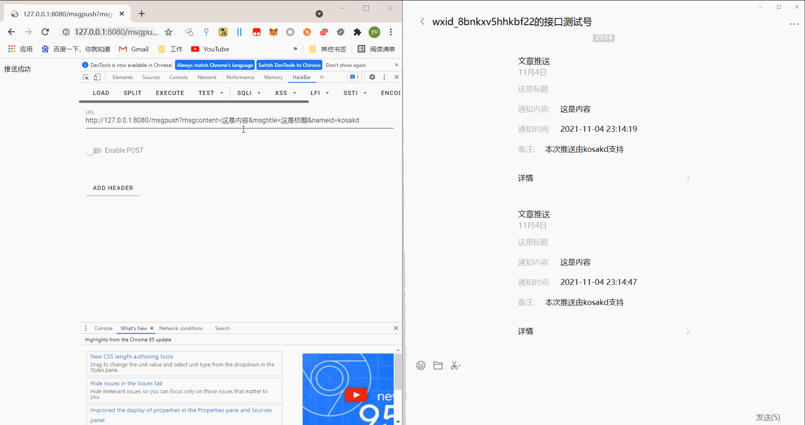
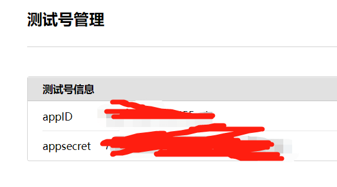
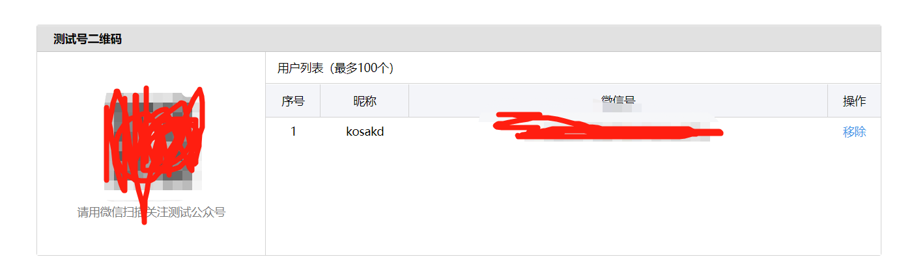
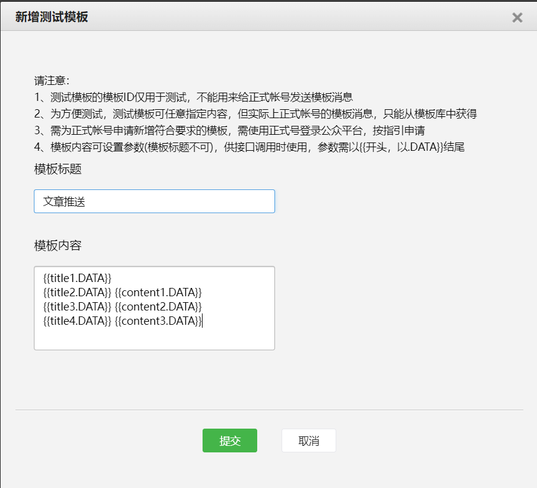
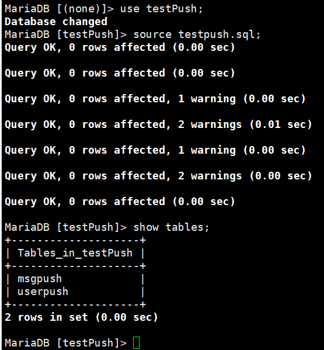
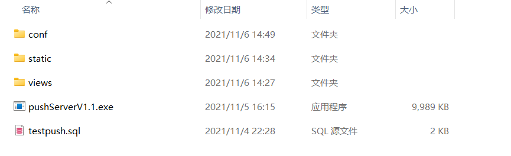
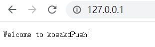
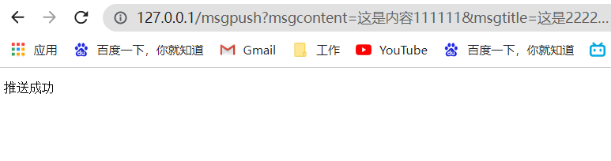
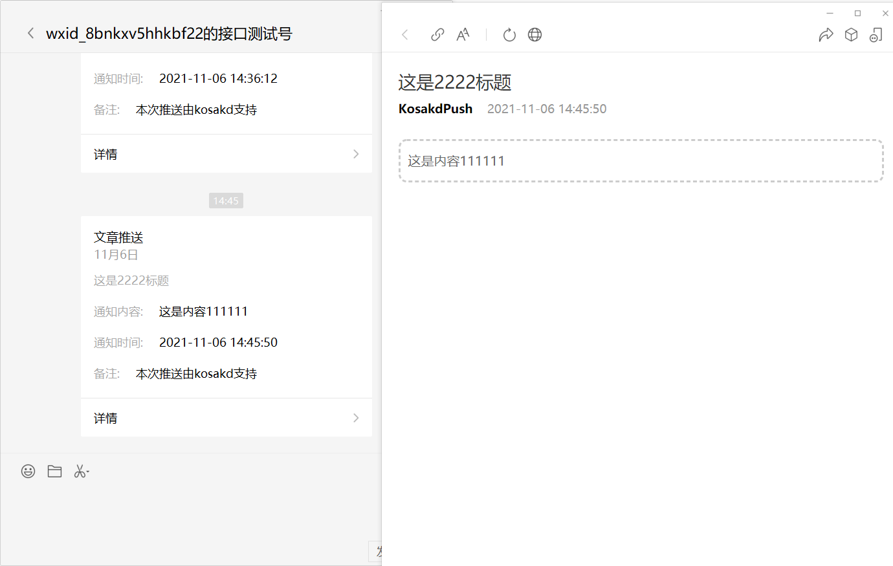

# 实现server酱同款微信推送



这次是因为，新版server酱要收费，还限制一分钟，只能推送5条信息，以前一直用的老版本的，但是老版本的也限制了推送数量，每天一百条，就麻烦，所以就不麻烦service酱的服务器来做推送服务了，咱们自己造一个，原理很简的，就是调用微信公众号的接口，来实现模板消息推送

应为我的公众号再创建的时候选择的是个人，所以不能进行认证，也就不能给用户推送模板消息，所以此程序是基于微信公众平台接口测试，来实现的微信公众号消息推送的，每个人都可以到这里去申请测试号

`https://mp.weixin.qq.com/debug/cgi-bin/sandbox?t=sandbox/login`

账号登录成功后，把appID，appsecret，写入配置文件，



然后再测试号二维码，扫描关注测试公众号，会获得一个微信号，把获取的微信号写入数据库表中，详情看下面数据库配置，应为我的公众号不能认证，也就没有写用户注册的功能，只能手动将用户消息添加到数据库中



最后在模板消息接口新增模板

模板标题随意填写，可以写，文章推送

模板内容：

```
{{title1.DATA}}
{{title2.DATA}} {{content1.DATA}}
{{title3.DATA}} {{content2.DATA}}
{{title4.DATA}} {{content3.DATA}}
```

配置完成后，会有一个模板ID，把模板id，写入配置文件中的，Templateid中，一切都配置完成后，即可运行程序




消息推送：

urlPath：/msg?msgcontent=这是消息内容&msgtitle=这是消息标题&nameid=kosakd

三个参数，msgtitle : 消息标题，msgcontent : 消息内容，nameid : 用户名

可以GET/POST提交请求

成功推送发送返回：推送成功，

则推送失败否则返回：参数错误。


## 配置文件

配置文件在，/conf/conf.yaml，具体参数看注释有详解

```yaml
# 配置文件


Server:
  Ip: "" #这是服务ip,留空代表本机
  Port: "80" #服务端口号
  ReadTimeout: 10 #web服务请求延迟,单位为秒
  WriteTimeout: 10 #web服务响应延迟，单位为秒

VxPush:
  Appid: "xxxxxxxxxxxxxxxxxxxxxxxxxxxxxxxxxxxx" #appID
  Secret: "xxxxxxxxxxxxxxxxxxxxxxxxxxxxxxxxxxxxx" #appsecret
  Templateid: "tmsxxxxxxxxxxxxxxxxxxxxxxxxxxxxxx" #模板ID
  Url: "https://kosakd.top" #推送到微信模板消息中的url，自定义

Mysql:
  Addr: "localhost:3306" #mysql服务连接的id和端口
  User: "kosakd" #mysql的用户名
  Passowrd: "kosakd" #mysql的用户密码
  DbName: "testpush" #mysql的指定数据库名
  
  
```


## 创建一个数据库，导入sql文件

```mysql
CREATE DATABASE IF NOT EXISTS testPush DEFAULT CHARSET utf8 COLLATE utf8_general_ci;

use testPush;

source testpush.sql;
--最后手动添加一条用户数据，（用户名，关注公众号的微信号，这里的微信号是指获取关注测试公众号的微信号）
INSERT INTO `userpush` VALUES ('kosakd', 'o-xxxxxx');
```




## 运行

- ​	可以直接下载对应系统，编译好了的文件，设置下配置文件，就可以直接运行，当然要确保，mysql服务开启了，数据库和数据表创建了

  




直接运行pushServerV1.1.exe,然后访问，你的web服务器，path / 正常的话会显示



 发送一条消息，/msgpush?msgcontent=这是内容111111&msgtitle=这是2222标题&nameid=kosakd

成功推送发送，推送成功，否则是，参数错误，则推送失败




## 拓展

这个版本的程序还是只有一个微信推送功能，你们有想法可以，去扩展接口，增加一些推送接口，比如说，企业微信，钉钉，pustPuls，tg，这些，只要写对应的推送功能函数就行，在数据表中，添加给关键字，来选择是什么推送，还可以多设置几个推送模板，实现不同消息模板推送，这样一眼就能够看出来是，文章推送，还是主机上线，还是钓鱼上线，最主要的是这个程序也是个整合推送接口，看你怎么使用了，结合自己的工具来实现消息实时推送了，比如说爬虫，钓鱼，漏洞扫描结果，这些需要长时间才出结果的程序，最后可以写一个app，来查询当前用户发送的所有消息，类似于server酱的app，服务器端写一个接口放出加密的所有信息，app接受解密显示（以上这些功能我已经再最新版本实现了，但是为了程序安全，还是只放出这个版本出来 ：）


## 个人博客微信公众号：


Blog,[kosakd.top](https://kosakd.top/)

公众号：kosakd


